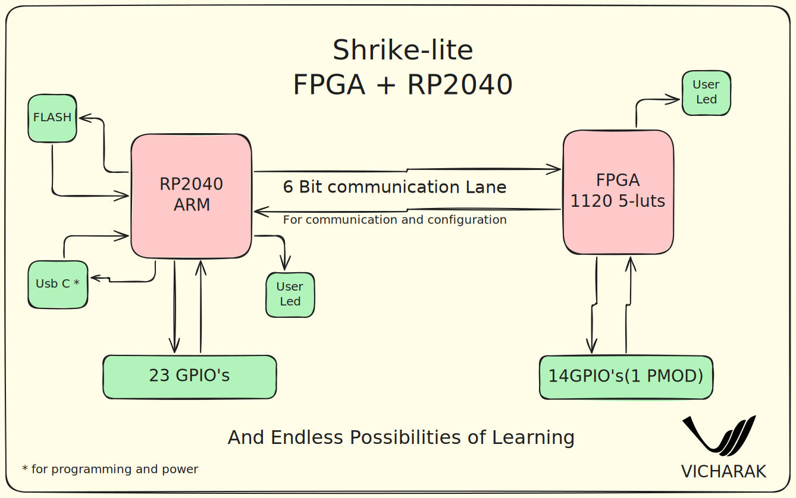

.. _shrike-home:

..
   Vicharak master file, created by
   sphinx-quickstart on Tue May  9 19:32:34 2023.
   You can adapt this file completely to your liking, but it should at least
   contain the root `toctree` directive.

.. rst-class:: lead

##############################################
 Welcome to Shrike-lite  FPGA's documentation!
##############################################

We at vicharak.in usually work on very complex FPGA-based projects built around Vaaman and its upcoming series. However, Shrike-lite is a passion project at Vicharak, driven by our love for engineering across both embedded microcontrollers and FPGAs.

Our goal is to make FPGAs accessible to everyone by offering robust toolchains, high-quality hardware, and strong ecosystem support. We’re committed to keeping the hardware prices extremely low, and every piece of software for Shrike will be completely open-source.

We invite contributors from all over the world to join us in this mission. Together, let’s make FPGA technology truly accessible to all.

Shrike-lite is lighter version of world's first fully open source FPGA Dev board crowdsupply releasing on CrowdSupply Renesas Forge FPGA SLG47910 and RP2350.

We at vicharak have kept in mind need of a learner, maker and a hobbyist while designing this art. This dev board will be your stepping stone in the field of FPGA , reconfigurable and heterogenous computing.

.. toctree::
   :glob:
   :caption: Contents
   :titlesonly:

   Hardware Overview <hardware_overview>
   Getting Started <getting_started> 
   Tools Setup <tools_setup_guide>
   Generating Bitstream <generating_your_first_bitstream>
   Verilog Style Guide <verilog_style_guide>      
   Shrike Pinouts <shrike_pinouts>
   Shrike CLI Guide <shrike_cli_guide>
   

.. note::

   We welcome contributions and bug reports through our `GitHub
   repository <https://github.com/vicharak-in/shrike-lite>`_.

