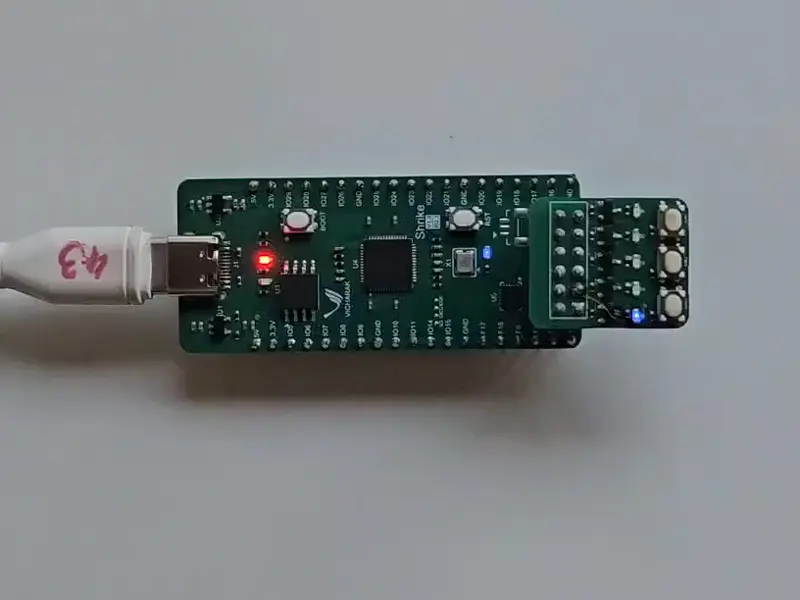

# SHRIKE-lite

We usually work on very complex FPGA-based projects built around Vaaman and its upcoming series. However, Shrike-lite is a passion project at Vicharak, driven by our love for engineering across both embedded microcontrollers and FPGAs.

Our goal is to make FPGAs accessible to everyone by offering robust toolchains, high-quality hardware, and strong ecosystem support. We’re committed to keeping the hardware prices extremely low, and every piece of software for Shrike will be completely open-source.

We invite contributors from all over the world to join us in this mission. Together, let’s make FPGA technology truly accessible to all. 

Shrike-lite is lighter version of world's first fully open source FPGA Dev board [crowdsupply](https://www.crowdsupply.com/vicharak/shrike) releasing on CrowdSupply Renesas Forge FPGA SLG47910 and RP2350. 

We at vicharak have kept in mind need of a learner, maker and a hobbyist while designing this art. This dev board will be your stepping stone in the field of FPGA, reconfigurable and heterogenous computing. 

### Board level Block Diagram

### Key Features : 

1.  FPGA with 1120 5 Input LUT's
2.  RP2040 - ARM Cortex M0
3.  PMOD Compatible Connector
4.  Bread Board compatible 
5.  IO interface Between FPGA and MCU
6.  QSPI Flash 
7.  2x User LED's
8.  Type C Port for Power and Programming 

 

### Check out 
 1. [Getting started guide](./Docs/getting_started.md) .
 2. [PIN_OUTS](./Docs/shrike_pinouts.md)

 
## Useful Links : 
1. FPGA Datasheet - [Renesas Forge FPGA ](https://www.renesas.com/en/products/slg47910#overview)

2. EDA Tool - [Go Configure Software Hub](https://www.renesas.com/en/software-tool/go-configure-software-hub)

3. RP2040 Related Resources- [Getting Started ](https://projects.raspberrypi.org/en/projects/getting-started-with-the-pico)

## 📫 Join our communities at :
  
     &nbsp;   &nbsp;   &nbsp;   &nbsp;   &nbsp;

### Note
 
We are building a ecosystem for learners , makers and hobbyist around shrike and the projects that will follow in future, thus we request you contribution in the same. Join our communities across all the platforms, pitch and showcase your ideas with Shrike. 

Thank You 
 

### FPGA CPU Interconnect Pin-outs 

| FPGA PIN | RP 2040 PIN |       RP2040         |       FPGA             |
|----------|-------------|----------------------|------------------------|
| EN       | 13          | GPIO                 | EN (Enable)            |
| PWR      | 12          | GPIO                 | PWR                    |
| 3        | 2           | GPIO                 | SPI_SCLK               |
| 4        | 1           | UART RX / GPIO       | SPI_SS                 |
| 5        | 3           | GPIO                 | SPI_SI (MOSI)          |
| 6        | 0           | UART TX / GPIO       | SPI_SO (MISO) / CONFIG |
| 18       | 14          | GPIO / I2C 1 SDA     | GPIO                   |
| 17       | 15          | GPIO / I2C 1 SDA     | GPIO                   |

 

## Contribution Guideline  

Your contribution to the Shrike project are always welcome.
To contribute fork the project test your changes and create a PR. Few things in to keep in mind for better contribution. 

1. Try to document as much as possible. 
2. Keep your design clean and readable.
3. Do not push unnecessary directories and .env.
4. Make sure your changes can be recreated. 

#### A Note for Contributors ❤️

We really appreciate everyone’s enthusiasm in improving the project!  
However, please avoid opening PRs for very small changes such as:
- Minor rewording of documentation (that doesn’t improve clarity)
- Typo fixes in comments or README
- Indentation or formatting-only edits

These types of changes create noise in the PR queue and make it harder to review substantial contributions.  
If you spot something small, feel free to open an **issue** instead so we can batch those improvements together. 

## Resources 
 #### 1. Learning Resources 

   1. [AISC WORLD Verilog Tutorials ](https://www.asic-world.com/verilog/veritut.html)
   2. [Nandland FPGA Tutorials](https://nandland.com/fpga-101/)
   3. [FPGA for Fun](https://www.fpga4fun.com/)
   4. [Lawrie FPGA Tutorials](https://lawrie.github.io/blackicemxbook/)
   5. [ProjectF](https://projectf.io/)
  
 #### 2. Similar Hardware Projects 
   1. [Ulx3s-Project](https://ulx3s.github.io/)
   2. [TinyFPGA-Project](https://tinyfpga.com/)
   3. [icebreaker-Project](https://github.com/icebreaker-fpga/icebreaker)
   4. [pico-ice](https://pico-ice.tinyvision.ai/)
   
