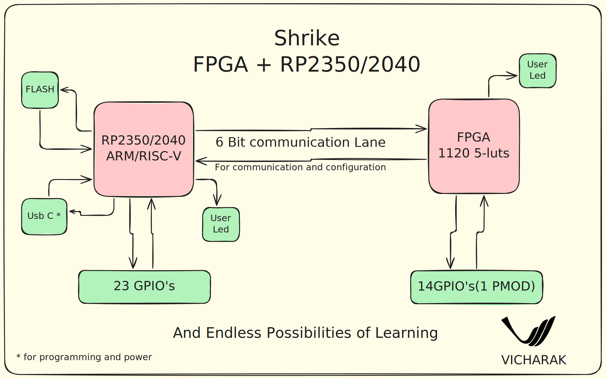

# Shrike 

Shrike is a family of low cost affordable FPGA development board along with a host microcontroller. 
Currently the family features these two members -: 

1. Shrike-lite (FPGA with RP2040) 
2. Shrike      (FPGA with RP2350) 

And a lot version under development.

We usually work on very complex FPGA-based projects built around [Vaaman](https://vicharak.in/vaaman) and its upcoming series. However, Shrike is a passion project at Vicharak, driven by our love for engineering across both embedded microcontrollers and FPGAs.

Our goal is to make FPGAs accessible to everyone by offering robust toolchains, high-quality hardware, and strong ecosystem support. We’re committed to keeping the hardware prices extremely low, and every piece of software for Shrike will be completely open-source.

We at vicharak have kept in mind need of a learner, maker and a hobbyist while designing this art. This dev board will be your stepping stone in the field of FPGA, reconfigurable and heterogenous computing.

We invite contributors from all over the world to join us in this mission. Together, let’s make FPGA technology truly accessible to all. 

### Get the Hardware 

Shrike-lite the RP2040 version of the family is available at our store for worldwide shipping and the Shrike RP2350 version will be available on the crowdsupply soon. You can follow the links below to get both.

#### 1. [Shrike-lite](https://store.vicharak.in/?product=shrike&post_type=product&name=shrike&v=13b5bfe96f3e)

#### 2. [Shrike](https://www.crowdsupply.com/vicharak/shrike)

### Board level Block Diagram

### Key Features : 

| **Feature**                          | **Shrike**                         | **Shrike-lite**                   |
|:-----------------------------------:|:----------------------------------:|:---------------------------------:|
| FPGA                                | 1120 × 5-input LUTs                | 1120 × 5-input LUTs               |
| MCU                                 | RP2350                            | RP2040                            |
| PMOD Compatible Connector           | ✅                                | ✅                                |
| Breadboard Compatible               | ✅                                | ✅                                |
| FPGA ↔ MCU IO Interface             | ✅                                | ✅                                |
| QSPI Flash                          | 4 MB                              | 4 MB                              |
| User LEDs                           | 2                                 | 2                                 |
| USB Type-C (Power & Programming)    | ✅                                | ✅                                |

### Check out 
 1. [Documentation](https://vicharak-in.github.io/shrike/index.html)
 2. [Pin_outs](https://vicharak-in.github.io/shrike/shrike_pinouts.html)
 3. [FPGA_CPU_Interconnect](https://vicharak-in.github.io/shrike/shrike_pinouts.html#fpga-rp2040-communication-pin-outs)

## 📫 Join our communities at :
  
     &nbsp;   &nbsp;   &nbsp;   &nbsp;   &nbsp;

### Note
 
We are building a ecosystem for learners , makers and hobbyist around shrike and the projects that will follow in future, thus we request you contribution in the same. Join our communities across all the platforms, pitch and showcase your ideas with Shrike. 

Thank You 

## Contribution Guideline  

Your contribution to the Shrike project are always welcome.
To contribute fork the project test your changes and create a PR. Few things in to keep in mind for better contribution. 

1. Try to document as much as possible. 
2. Keep your design clean and readable.
3. Do not push unnecessary directories and .env.
4. Make sure your changes can be recreated. 

#### A Note for Contributors ❤️

We really appreciate everyone’s enthusiasm in improving the project!  
However, please avoid opening PRs for very small changes such as:
- Minor rewording of documentation (that doesn’t improve clarity)
- Typo fixes in comments or README
- Indentation or formatting-only edits

These types of changes create noise in the PR queue and make it harder to review substantial contributions.  
If you spot something small, feel free to open an **issue** instead so we can batch those improvements together. 

Thank You

## Useful Links : 
1. FPGA Datasheet - [Renesas Forge FPGA ](https://www.renesas.com/en/products/slg47910#overview)

2. EDA Tool - [Go Configure Software Hub](https://www.renesas.com/en/software-tool/go-configure-software-hub)

3. RP2350/RP2040 Related Resources- [Getting Started ](https://www.raspberrypi.com/documentation/microcontrollers/pico-series.html)