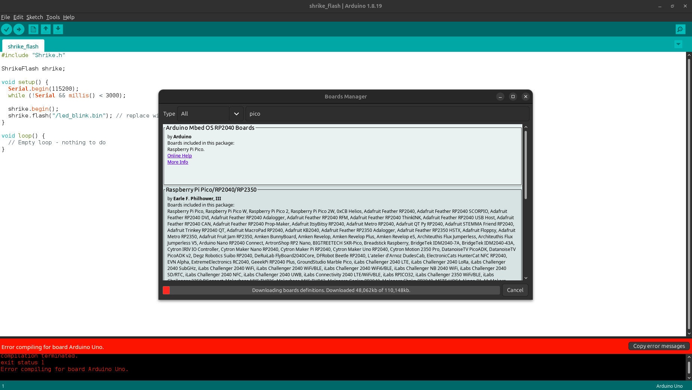
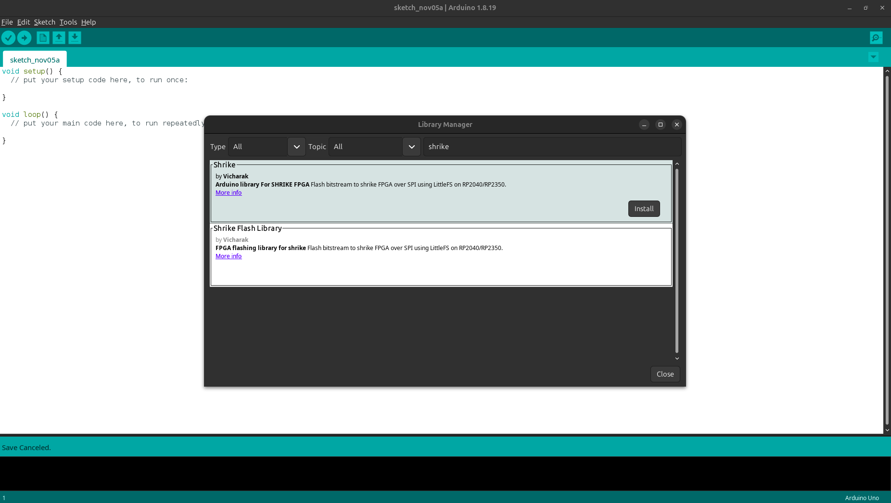

(shrike_arduino_guide)=

# Using Shrike With ArduinoIDE

If you are someone who is familiar with arduino and its infrastructure and don't want to move away to micro-python no worries we have got you cover.

These are the steps you can follow make arduino IDE usable with shrike.

Now before starting you should know that you will still need to use the Renesas Go configure software hub for generating firmware for fpga however all the other task can be done from arduino ide. 

Now we will follow these steps to setup our arduino IDE for shrike. If you don't have arduino IDE already ,you can download it from [here](https://www.arduino.cc/en/software/) or if you are using linux(ubuntu)then just run 
```
sudo apt install arduino
```

### Step 1. Adding the board support for RP2350/RP2040

The Shrike has a on board RP2350/RP2040 has a host controller the Arduino IDE doesn't native support them however we can add the board support for the same. 
It is quit straight forward we need to add this URL 
```
https://github.com/earlephilhower/arduino-pico/releases/download/global/package_rp2040_index.json
``` 
in the addition board URL section of arduino IDE which you can find in File->Preferences.

<div align="center">

 

</div>

If you already have another board URL just add a "," between the two URL's.

These board support had been created by [earlephilhower](https://github.com/earlephilhower) and you can check out github [repository](https://github.com/earlephilhower/arduino-pico) for more details.

After adding the URL go to Tools->Boards->Board Manager in the Arduino IDE. 
Then search for pico and the board from Earle F. Philhower. 

<div align="center">

 

</div>
Perfect we have successfully add the board support for the RP2040/RP2350.

### Step 2. Adding the Little-FS Tool 

Now we need to add a Little-FS utility to bind a bin file (FPGA bitstream with code for Shrike). We can find the utility [here](https://github.com/earlephilhower/arduino-pico-littlefs-plugin/releases/) download the latest release ZIP. 

Now we need to unzip and copy it to the tools directory in Arduino directory.

In case of windows you will find the Arduino folder in C disk if you have not changed it during installation.
In case of linux it would be available in your home directory. 

The directory/ folder  should look like this `<home_dir>/Arduino/tools/PicoLittleFS/tool/picolittlefs.jar`

Now you will need to restart the Arduino IDE and you should see the Pico Little FS tool like this in your Tools menu.


For more details on the PicoLittleFS tool checkout this [repository](https://github.com/earlephilhower/arduino-pico-littlefs-plugin).

### Step 3. Installing the Shrike Library 

Now we need to add the Shrike Library in arduino to do so go to library manager in arduino IDE and search Shrike and install the Shrike library.

<div align="center">

 

</div>

Choose the first one names as Shrike and not the shrike flash library.
We are almost done with the setup lets continue and blink en led on FPGA using the arduino IDE. 

### Step 4. Programming the FPGA from ArduinoIDE
Lets program out first bitstream to fpga using the arduino. We will be blinking an led.

StartArduino IDE and look for Shrike >- shrike_flash in the example section of IDE and then save it with a name of you choice and at a location of your choice. This will create a folder with the name, now in the folder/dir create a subfolder by name `data` keep the case and in mind. 

Any bitstream that needs to be uploaded to the board should be placed in the folder. 
We have already generated and hosted a bitstream to blink led [here](https://github.com/vicharak-in/shrike-lite/blob/main/test/bitstreams/v1_4/led_blink.bin) save this bitstream to the data subfolder.

Checkout guide to learn how to generate your own fpga design [here](./generating_your_first_bitstream.md).

Onces you have done this go to arduino and hit compile your compilation should finish without error if error occurs don't we have s discord hope on there. 

If the compilation has been done without any error then it's time to connect the board in boot mode " PRESS THE BOOT BUTTON WHILE CONNECTING THE BOARD WITH PC" ( this should be done only the first time of setting up if arduino are if you have programmed the board with any other way last time).

And then hit upload on the board. 

You should see the beautiful blue led blinking on board.

Congratulation you have you arduino IDE and shrike ready to programmed using the Arduino infrastructure. 


>Credit and Gratitude  to [earlephilhower](https://github.com/earlephilhower/) to creating the board support for RP2040/RP2350 in ArduinoIDE and the little FS tool. 