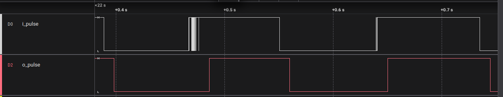

# Debouncer Module

Mechanical switches do not change state cleanly when pressed or released. Instead, they bounce rapidly between HIGH and LOW for a few milliseconds, which can cause multiple false triggers in digital logic. A debounce circuit solves this by checking whether the input has remained stable for a fixed period. If the signal stays unchanged long enough, it is accepted as the new valid state; otherwise, it is ignored. This ensures the output is clean, stable, and free from glitches caused by mechanical bouncing.

---
## Overview of FPGA side
- This project consists of two modules :   
    1) `debouncer :` This module contains a hardware debouncer for cleaning noisy input signals such as mechanical switches or push-buttons used as inputs in the Shrike-Lite FPGA. This module ensures that the output only changes state when the input remains stable for a defined duration.
    2) `top : ` A multi-channel top module that instantiates multiple debouncer modules using a generate loop. The number of debouncer instances is controlled by the parameter `NUM_PORTS` 

---

## Features
- Configurable multi-channel support using `NUM_PORTS`
- Eliminates the unwanted bounces made by mechanical swithes  
- Default 10 ms debounce at 50 MHz (can be configurable) 
- Clean, stable output (`o_pulse`)

---

## Module Interface

| Signal        | Direction | Description                          |
|---------------|-----|--------------------------------------|
| `clk`         | In  | System clock (50 MHz typical)        |
| `i_pulse`     | In  | Raw mechanical switch/button input   |
| `o_pulse`     | Out | Debounced output                     |
| `o_pulse_en`  | Out | Output enable (always 1)             |
| `clk_en`      | Out | Clock enable (always 1)              |

---
### Parameters Used
- `DEBOUNCE_CNT_LIMIT :` Parameter to adjust the Debounce duration. This parameter controls the amount of time the input signal must stay unchanged before the module updates the output.
- `NUM_PORTS :` Parameter to adjust the number of the debouncer instances to generate.  
---

## Debounce Time Calculation
The debounce duration is controlled by:

```verilog
localparam DEBOUNCE_CNT_LIMIT = 5_00_000;  // ~10 ms at 50 MHz
```
To change debounce time:
``` 
DEBOUNCE_CNT_LIMIT = (Debounce_Time / Clock_Period)

In this example: 
Debounce_Time = 10 ms (0.1s)
Clock_Period  = 20 ns (for 50MHz)

DEBOUNCE_CNT_LIMIT = Debounce_Time / Clock_Period
                   = 0.01 s / 20 ns
                   = 500,000 cycles
```
--- 

## Pin Usage for Testing
This design was tested using two different output configurations:
#### 1. Direct FPGA Output (Standalone Test)
| FPGA Pin | Signal Name | Direction | Description                       |
|----------|-------------|-----------|-----------------------------------|
| F0       | i_pulse     | Input     | Raw switch/button input signal    |
| F1       | o_pulse     | Output    | Debounced, clean output signal    |

#### 2. FPGA Output Routed to RP2040 MCU (FPGA → MCU Interconnect Test)

|  Pin | Signal Name | Direction | Description                       |
|----------|-------------|-----------|-----------------------------------|
| F0   | i_pulse     | Input     | Raw switch/button input signal    |
| F3 and GPIO2(RP2040)     | o_pulse     | Output    | Debounced, clean output signal    |

When testing through the RP2040 MCU, load the Arduino sketch that reads the FPGA interconnect pin. The pin number in your FPGA constraints must match what is used in the Arduino code.

> **Note:**  
> The output signal `o_pulse` can connected to standard GPIO pin of FPGA, or can also be connected to the RP2040 MCU on the Shrike‑Lite board through any FPGA-to-RP2040 interconnect pins. For details on available interconnections and pin mapping, refer to the [Shrike‑Lite pinout reference](https://github.com/vicharak-in/shrike-lite/blob/main/Docs/shrike_pinouts.md).


## Output Capture

The following screenshot shows the `i_pulse` input (raw switch signal) and the `o_pulse` output (debounced signal) captured on a logic analyzer:




